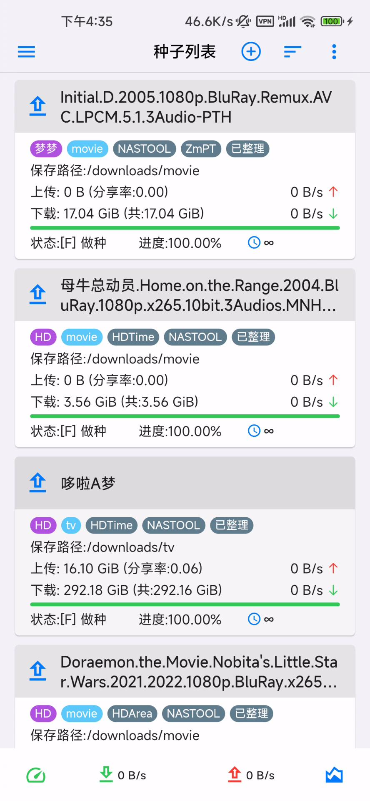
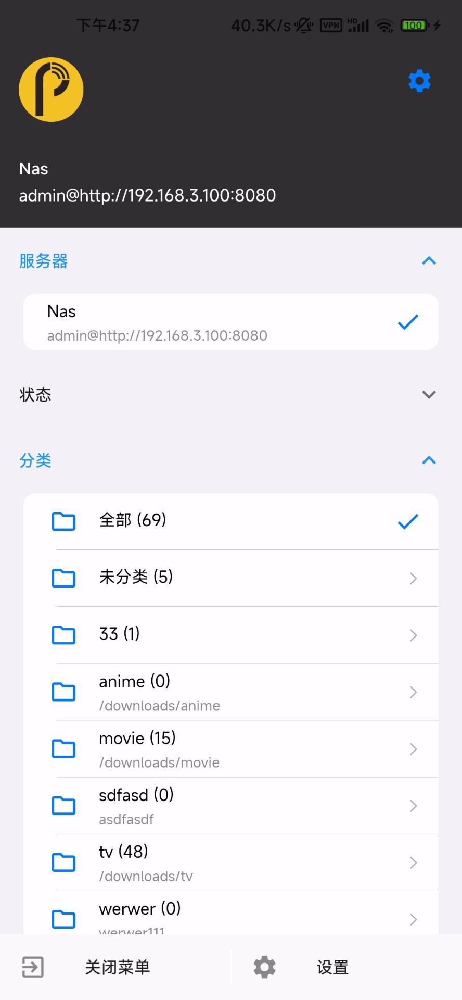
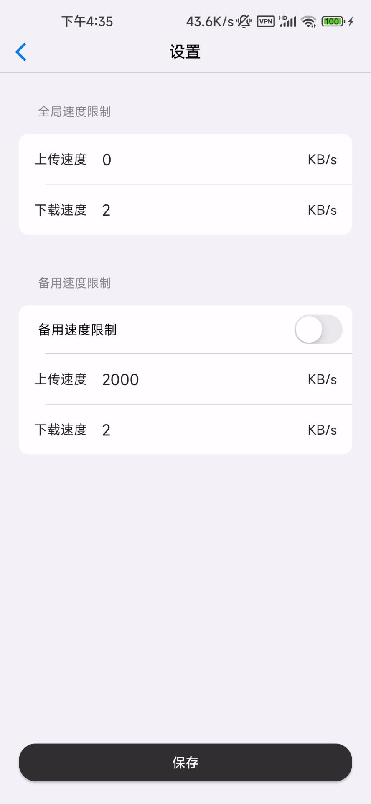
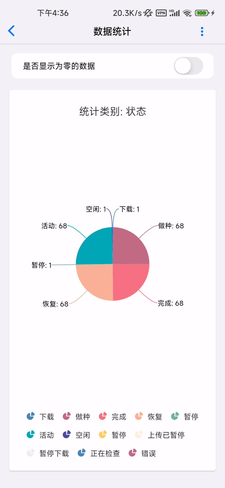
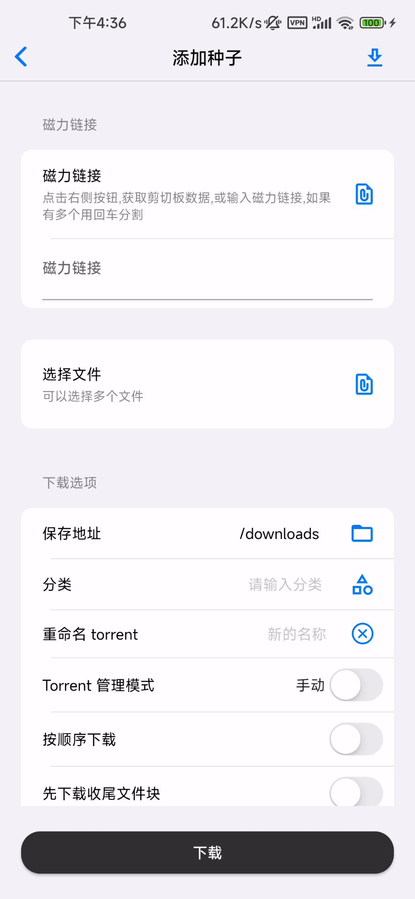
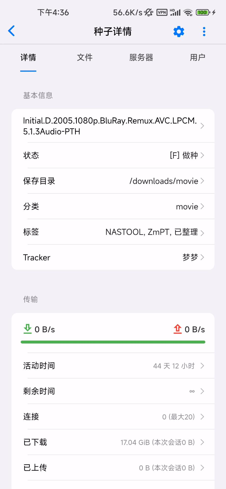
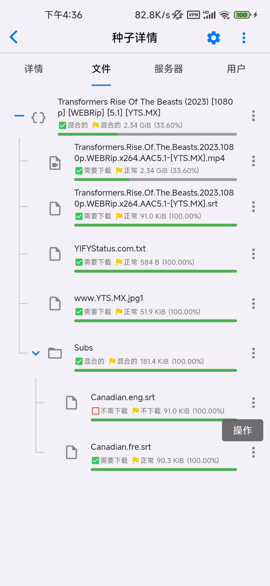
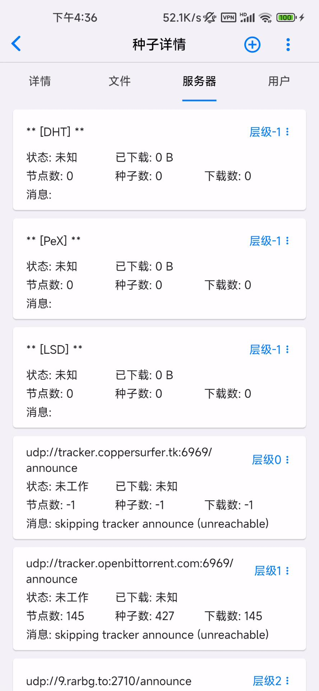

## 管理你的QBittorrent,Transmission

此项目仅用于收集bug, 并非项目源码

### 使用说明

* 初次使用需要配置服务器

1. 点击 `添加服务器并登录` 按钮进入添加页面
2. 输入备注,随便取个名称,如: Nas
3. 输入服务器地址, 可点击 `http://` 进行协议切换, 如在浏览器访问地址是 `http://192.168.3.100:8080` 那么需要填入 `192.168.3.100:8080`
4. 输入用户名,密码, 选择服务器类型,默认为QBittorrent

### QBittorrent 基本功能已经完成,更多功能正在开发中

#### QBittorrent 部分页面截图

### Transmission 已完成部分功能,更多功能正在开发中

### 用爱发电,感想您都支持 

* 如果你觉得对你有帮助可以扫描下面二维码随意打赏下哦！

