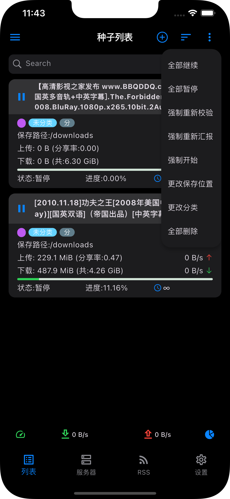
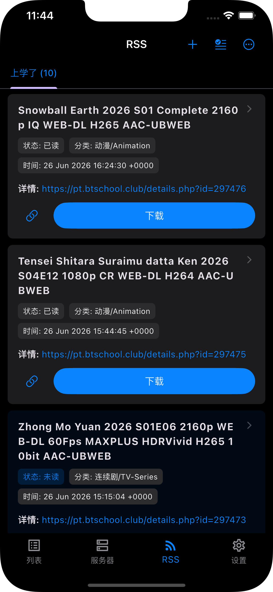
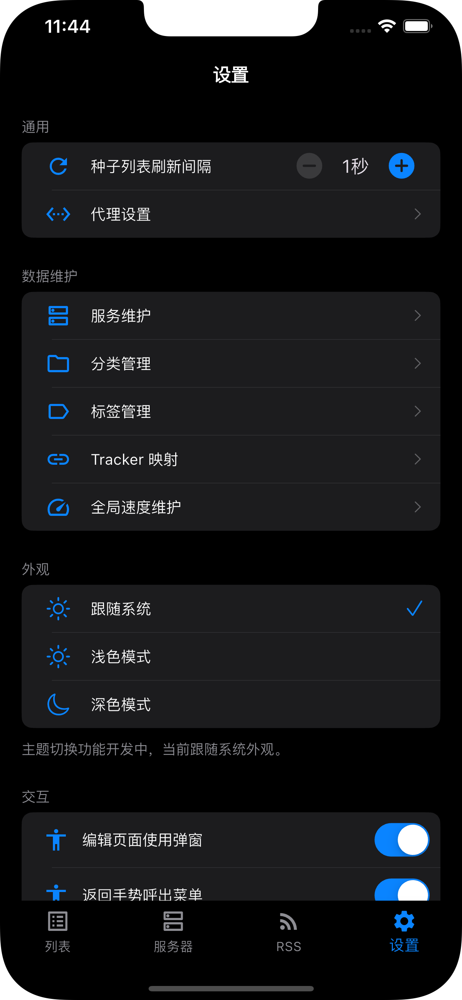
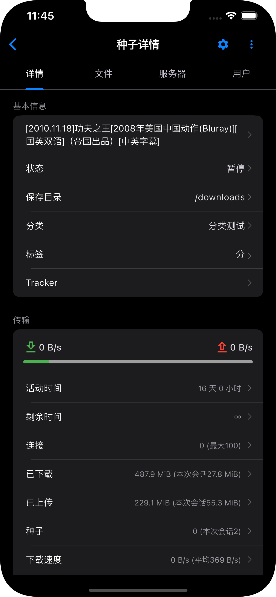
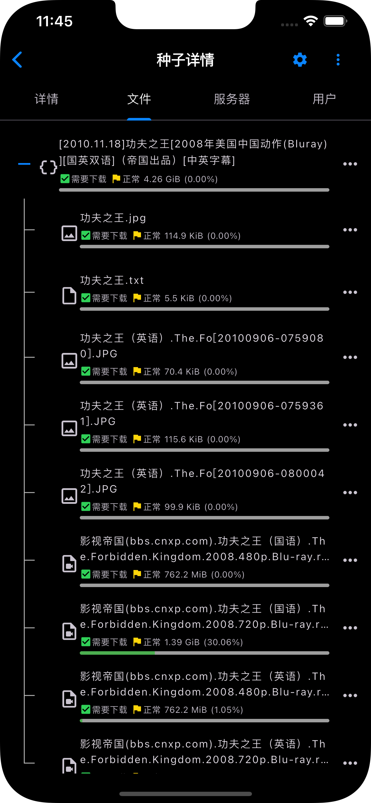
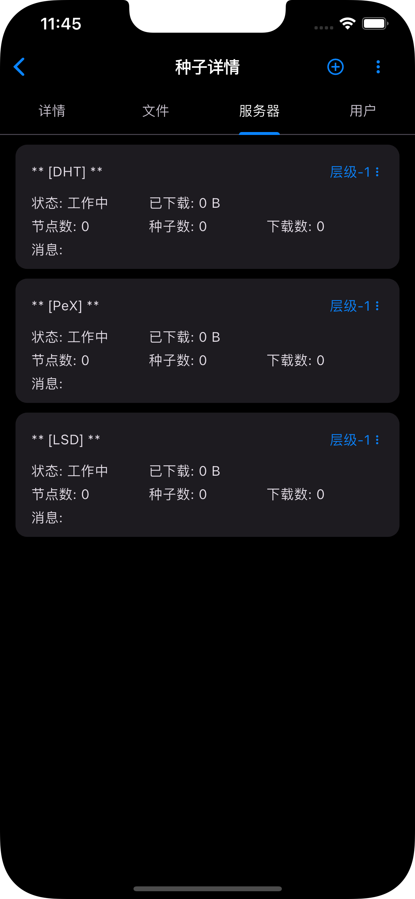
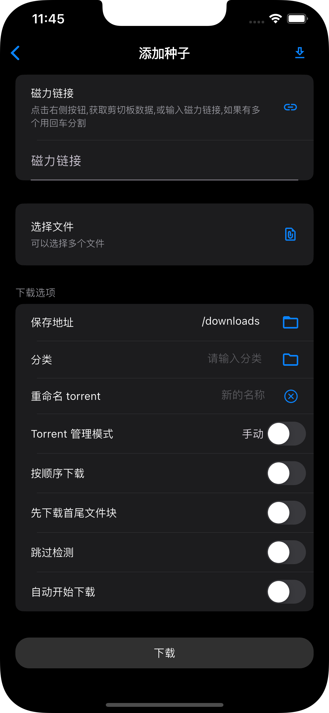
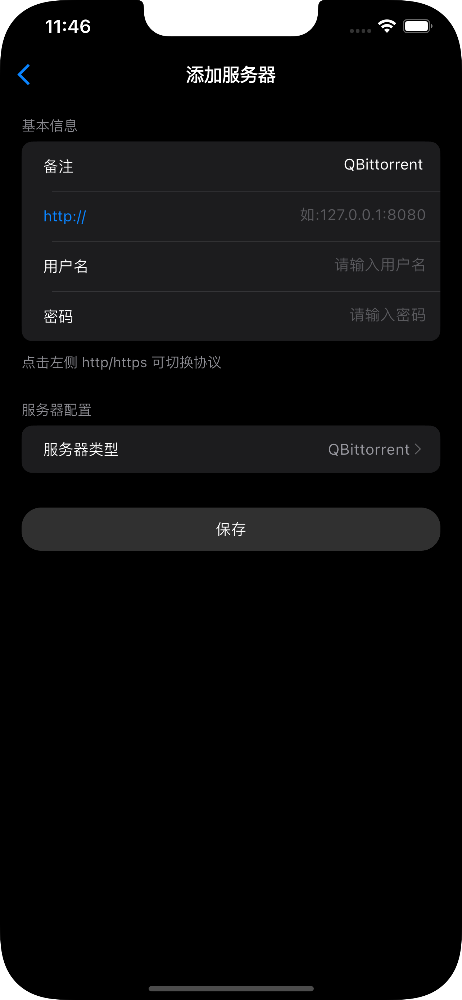
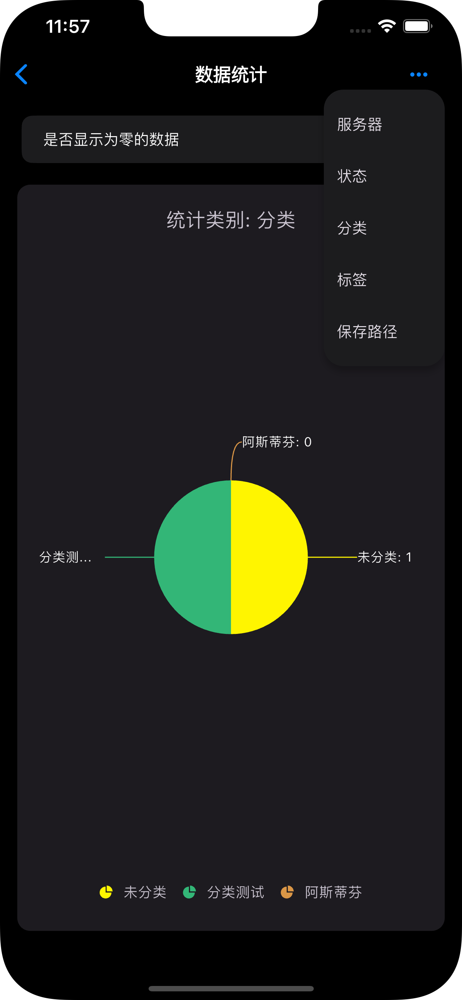

# QBittorrent Client & FileZen

这里是 QBittorrent Client 与 FileZen 的反馈、说明和下载入口。两个 App 都已经上架 App Store，欢迎下载 iOS / iPadOS 版本体验。

## App Store 下载

| App | 中国区下载 | 其他区域下载 | 支持网站 |
| --- | --- | --- | --- |
| QBittorrent Client | [App Store 中国区](https://apps.apple.com/cn/app/qbittorrent-client/id6779680498) | [App Store](https://apps.apple.com/app/id6779680498) | [技术支持](https://toutoumu.github.io/qbWeb/) |
| FileZen | [App Store 中国区](https://apps.apple.com/cn/app/filezen/id6764205706) | [App Store](https://apps.apple.com/app/id6764205706) | [技术支持](https://toutoumu.github.io/) |

## QBittorrent Client

QBittorrent Client 是一款用于连接和管理 qBittorrent Web UI 或 Transmission Web UI 的第三方移动端客户端。它适合已经在 NAS、家庭服务器、VPS 或个人电脑上部署 qBittorrent 或 Transmission 的用户，让你可以直接在 iPhone 或 iPad 上查看下载进度、添加任务、管理文件和调整常用设置。

### 为什么值得下载

- 远程连接你自己的 qBittorrent Web UI 或 Transmission Web UI，集中管理下载任务。
- 查看下载、上传、暂停、完成等状态，速度、进度、大小、剩余时间一目了然。
- 支持添加磁力链接和 torrent 任务，在移动端发起远程下载更方便。
- 支持任务详情、文件列表、Tracker、RSS、数据统计、分类与标签等常用管理场景。
- 服务器地址与登录信息仅用于连接你自己的 Web UI，开发者无法访问你的下载内容。

> QBittorrent Client 不是 qBittorrent 或 Transmission 官方应用，也不提供下载服务本身；使用前需要你已经启用自己的 qBittorrent Web UI 或 Transmission Web UI。

### 快速开始

1. 在 App 中点击 `添加服务器并登录`。
2. 输入备注名称，例如 `NAS` 或 `Home Server`。
3. 填写服务器地址。如果浏览器访问地址是 `http://192.168.3.100:8080`，App 中填写 `192.168.3.100:8080`，并按需切换 `http://` / `https://`。
4. 输入 qBittorrent Web UI 的用户名和密码，服务器类型选择 `QBittorrent`。
5. 保存并登录后，即可在手机上管理远程下载。

### QBittorrent Client 截图

  

  

  

## FileZen

FileZen 是一款面向 iPhone 和 iPad 的本地与远程文件管理应用。它把本地 Documents、外部挂载目录、OneDrive、Box、AList / OpenList、WebDAV、SFTP、SMB 等来源放进统一工作区，适合把手机文件、NAS、服务器和云盘放在一个入口里管理。

### FileZen 适合这些场景

- 统一浏览、搜索、排序和管理本地文件、外部目录与远程服务器文件。
- 在本地与远程之间上传、下载、移动、复制、重命名、删除文件。
- 直接预览图片、视频、音频、PDF、文本、压缩包和常见文档类型。
- 使用文本对比、文件夹对比、PDF 工具、下载中心、音乐播放列表等实用工具。
- 通过本地 Web 上传入口，让同一局域网内的浏览器把文件传到 iPhone 或 iPad。
- 支持加密容器，适合长期保存和整理个人重要资料。

FileZen 的核心能力可以免费体验，部分高级能力可通过激励广告获得时效解锁；如果你希望长期、稳定、少打扰地使用，也可以选择会员方案。

## 反馈与支持

- QBittorrent Client 支持网站：[https://toutoumu.github.io/qbWeb/](https://toutoumu.github.io/qbWeb/)
- FileZen 支持网站：[https://toutoumu.github.io/](https://toutoumu.github.io/)
- 邮箱：<toutoumu88@gmail.com>

## 关注更新

## 用爱发电

如果这些 App 对你有帮助，欢迎通过下面二维码支持开发。

 
